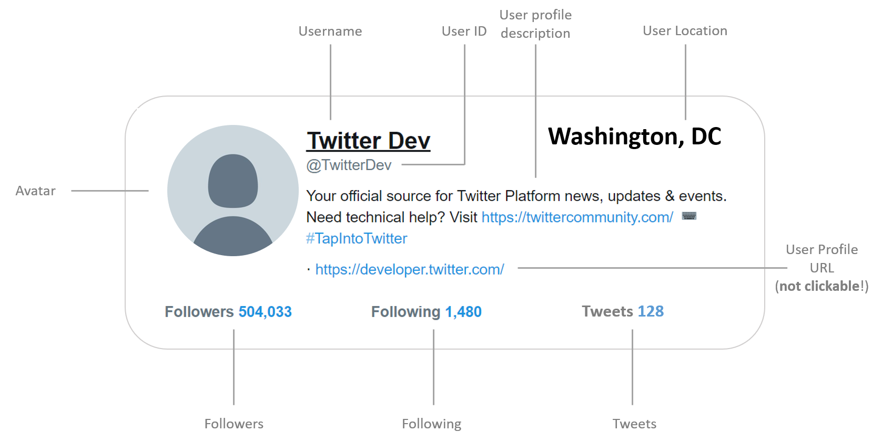
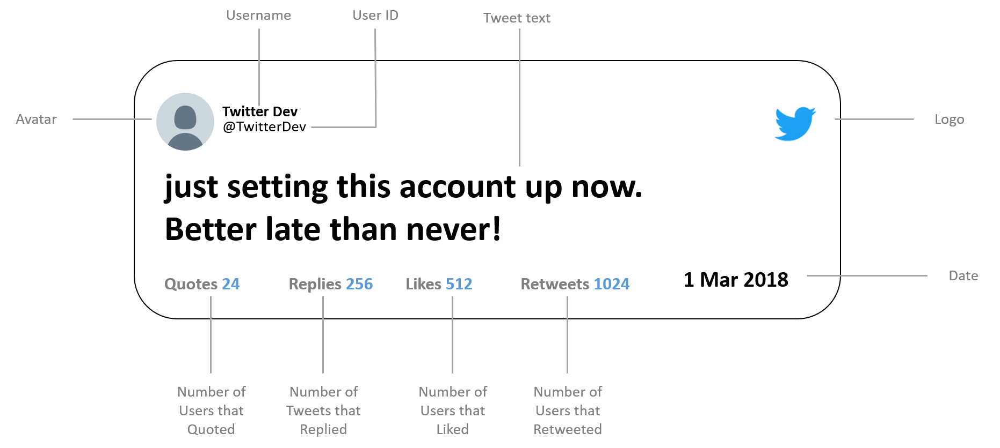

# Project 3
In this project, you will use data files of social media posts and accounts to design a user interface that reveals characteristics about suspicious activity from twitter users. This project bears many similarities to the previous project, but considers the issue from the other perspective - that of a content moderator or social media researcher.

You will be using <a href="https://about.twitter.com/en_us/values/elections-integrity.html#data">two data sets from Twitter</a>. These datasets represent an ongoing investigation into suspicious account activity that *may* be in support of a state-sponsored information manipulation campaign, that is, an attempt to sway conversation on social media to support a perspective. You need to download them from the links below for this project, but you will notice that the .gitignore file contains a listing for csv files. **DO NOT** alter this - these are huge files, and should not be stored in your online repository. There are two investigations described at the site - we will be using the Iranian event, in which 770 accounts engaged in coordinated behavior to manipulate public opinion.

1. A csv of user accounts associated with [suspicious activity](https://storage.googleapis.com/twitter-election-integrity/hashed/iranian/iranian_users_csv_hashed.zip)
2. A csv of [suspicious tweets](https://storage.googleapis.com/twitter-election-integrity/hashed/iranian/iranian_tweets_csv_hashed.zip)
3. **Supplemental**: Here is the [dataset description](https://storage.googleapis.com/twitter-election-integrity/hashed/Twitter_Elections_Integrity_Datasets_hashed_README.txt) for the fields in both csv files. Note that we are only using a small subset of the data available for this project.

**Notice - these are real tweets from real twitter users (or bots!), and do not reflect the view of your instructor, department, or university. Tweets may contain foul language  or worse. Do not follow the links associated with the profiles or tweets...just, don't.**

**Notice - on the site that you download these tweets, there is also a *Media* link for the images, videos, etc. that were contained in many of these tweets. Do not download the media data, as it's around 65GB (yes, with a G).**

## Step 0 - Background Research.
1. **Both members** should review the interview with Nathan Allen, moderator for Reddit's r/science at the <a href="https://www.dailydot.com/parsec/interview-with-nathan-allen/">Daily Dot</a>. This will give you an understanding of the challenges facing moderators who are attempting to keep the conversation civil while also promoting discussion. It's tough work.
2. **Both members** should read the blog post <a href="https://blog.twitter.com/official/en_us/topics/company/2018/an-update-on-our-elections-integrity-work.html">"An update on our elections integrity work"</a> by Twitter employees Del Harvey and Yoel Roth. This will give you more information on Twitter's approach to curtail suspicious activity and state-sponsored influence operations.

## Step 1 - Import and Clone the Repo for your Team.
1. Clone the repository to your local machines. You will then have a local repository that is linked to the shared repository, and can work on the code together.
1. As a reference for how to use git, I suggest <a href='http://codingdomain.com/git/'>this site</a>, as it avoids some of the more complicated theory behind git and focuses on the bare minimum practicalities.

## Step 2 - Review the provided code.
You are starting with the bare minimum to read the two data files and create objects from the data in each of them. A simple example is provided in the `TweetModerationGUI` code. You will notice that the parse methods use a `Try/Catch` mechanism to detect errors and keep running if one occurs. The languages in these data files are complicated, and can throw off simple parsing algorithms, so we just discard the tweets that do not process correctly - this is fine, because we have plenty!

```java
public class TweetModerationGUI extends Application {
    ArrayList<Tweet> tweets;
    ArrayList<User> users;

    protected BorderPane getBorderPane(ArrayList<User> users) {
        BorderPane pane = new BorderPane();
        Text text = new Text("Loaded " + users.size() + " users; 12 tweets");
        ArrayList<Pane> content = new ArrayList<Pane>();
        content.add(new Pane());
        content.add(new Pane());
        content.add(new Pane());
        ListView<Pane> lv = new ListView<>(
            FXCollections.observableArrayList(content));
        pane.setBottom(text);
        pane.setCenter(new ScrollPane(lv));
        return pane;
    }

    public void parseUsersAndTweets(){
        try{
            tweets = TweetParser.parseTweets("iranian_tweets_csv_hashed.csv");
            users = UserParser.parseUsers("iranian_users_csv_hashed.csv");
            System.out.println(tweets.size() + " tweets parsed");
            System.out.println(users.size() + " users parsed");
            for(Tweet tweet: tweets){
                for(User user: users)
                    if(tweet.getuserid().equals(user.getuserid())){
                        user.addTweet(tweet);
                        break;
                    }
            }
        }catch(Exception e){
            System.out.println("file error: "+ e.getClass().getCanonicalName());
            System.out.println(e.getMessage());
        }
    }

    @Override
    public void start(Stage primaryStage) {
        parseUsersAndTweets();
        Scene scene = new Scene(getBorderPane(users), 200, 200);
        primaryStage.setTitle("TweetModerator Demo");
        primaryStage.setScene(scene);
        primaryStage.show();
    }
}
```

## Step 3 - Finish the parsing methods.
Most of the work is done for you here, but to add all of the necessary data to the `User` and `Tweet` objects you will need more comprehensive constructors with getters and setters in those classes for all of the additional necessary fields. Note - not all fields are required for this assignment.

## Step 4 - Create a loading screen to modify the amount of parsed data.
The current implementations of the parsing methods has a built-in limit set so that you do not have to import both big files every time. For this step, you will modify both parsing classes so that they can accept parameters to limit the types of data they return. This means adding additional parameters to the current methods, or adding additional parsing methods, to accomplish this.

When your application is run, a window should pop up with options that limit the amount of data that will be parsed. Parsing should be modifiable using the following components:
- A slider to set the maximum umber of users parsed, from 1 to the maximum number of users in the dataset.
- A slider to set the maximum number of tweets parsed for each user, from 1 to the maximum number of tweets from a single user.
- A radio button for account language, with the following options: 1) English; 2) Other (anything other than English); 3) All
- A `Cancel` button that terminates the application.
- A `Parse` button that kicks off the parsing with the settings. When this button is clicked, the window will close, and one or more of the panes below will become visible (depending on how far you get). For an example of showing multiple windows, or `Stages`, refer to *Listing 14.2* in the textbook.

## Step 5 - Create a pane to review users.
Create a pane that lists all the users. Each user receives their own pane, according to the layout in the image below. You may use any combination of component panes described in the book to accomplish this.
- **Do not** try to make the spacing pixel perfect. You also do not have to download and use the Twitter typeface Helvetica Neue.
- **Do** try to recreate the relative position of data items as closely as possible. As for fonts, just pick a default font that is close to the look and feel of the fonts in these layouts.



## Step 5 1/2 - Commit and Push to Github
Remember, this is not like submitting a project to Blackboard all at the end. Commit / Push early and often to establish a rhythm with your partner(s). Do not wait until the last minute! While you are working on each step below, you should be backing up your work incrementally - save early, save often.

## Step 6 - Create a pane to review tweets.
Create a pane that lists all the tweets for *a single* user according to the layout in the image below. At the top of this pane, provide a radio button to show only: a) tweets; b) replies; c) tweets and replies.



## Step 7 - Create a pane to review the quotes and replies for a single tweet.
Create a pane that lists all the tweets in the data set that either quote or reply to *a single* tweet. These tweets should follow the same styling as the image above. At the top of this pane, provide a radio button to show only: a) quotes; b) replies; c) quotes and replies.

## Step 8 - Create an interactive layout for all three panes.
This is a layout in three columns:
- In the left column, place your pane to review users. When the layout is loaded, this should be populated with all the users found in the dataset (or as restricted by the loading screen).
- In the middle column, place your pane to review tweets. This pane should be initially empty. When a user is clicked in the left column, the middle column should show all the tweets for that user that have been loaded. If a different user is clicked in the left column, the middle collumn should switch to showing the tweets for that user.
- In the right column, place your pane to review quotes and replies. This pane should be initially empty. When a tweet is clicked in the middle column, the right column should show all the quotes and replies for that tweet that have been loaded. If a different tweet is clicked in the middle column, the right column should switch to showing the quotes and replies for that tweet. If a different user is clicked in the left column, the right column should be emptied until the user clicks on a tweet for that user.

## Step 9 - Sort users and tweets.
In the user pane that you created above, sort the users by the number of tweets. For the pane of tweets that you created above, sort the tweets by the number of replies. You have the option of using `Comparable` or `Comparator` - either one is fine.

## Step 10 - Push to Github
Do not forget to push your final submission to Github before the deadline.

# Grading
Grading will be assigned according to the following categories. As described in the syllabus, each category can receive a  &#10003; (satisfactory); a &#10003;+ (above and beyond); a &#10003;- (incorrect, incomplete, or sloppy); or in the worst case an &#10005;, meaning it was altogether missing or inappropriate (assigned at the instructor's discretion). A category assigned an &#10005; can carry significant grade penalties for this assignment.

1. Repository / Teamwork. Everyone contributed and used the repository well.
2. Comments and Code Formatting. The code is easy to follow and understand.
3. Project Design. The code is designed to do what the project requires.
4. Implementation. The code does what it was designed to do.

| Rating    | Repository                                                                                    | Form                                                                                                                                               | Design                                                                                                                                                                                                                                                                      | Implementation                                                                                                                                                                                                                            |
|-----------|-----------------------------------------------------------------------------------------------|----------------------------------------------------------------------------------------------------------------------------------------------------|-----------------------------------------------------------------------------------------------------------------------------------------------------------------------------------------------------------------------------------------------------------------------------|-------------------------------------------------------------------------------------------------------------------------------------------------------------------------------------------------------------------------------------------|
| &#10003;+ | Evidence of branching and merging.                                                            | Project is commented and styled according to [Javadoc](https://www.oracle.com/technetwork/java/javase/documentation/index-137868.html) Guidelines. | Project includes all steps.  | Project is free of logical and syntax errors; extensive and creative use of Java commands and classes to reduce length and/or complexity (Hint: this mostly means lambda expressions for this assignment, but includes other good style). |
| &#10003;  | Multiple commits from each teammate                                                           | Project is commented and styled neatly.                                                                                                            | Project includes working steps 1-6 with a visible attempt to complete the remaining steps.                                                                                                                                                                                  | Project compiles                                                                                                                                                                                                                          |
| &#10003;- | Evidence that one teammate did most of the work and/or all commits were through web interface | Comments are sparse and/or code styling is difficult to follow.                                                                                    | Project is missing one or more of the loading screen or three data view panes.                                                                                                                                                                                              | Project compiles with some minor correction                                                                                                                                                                                               |